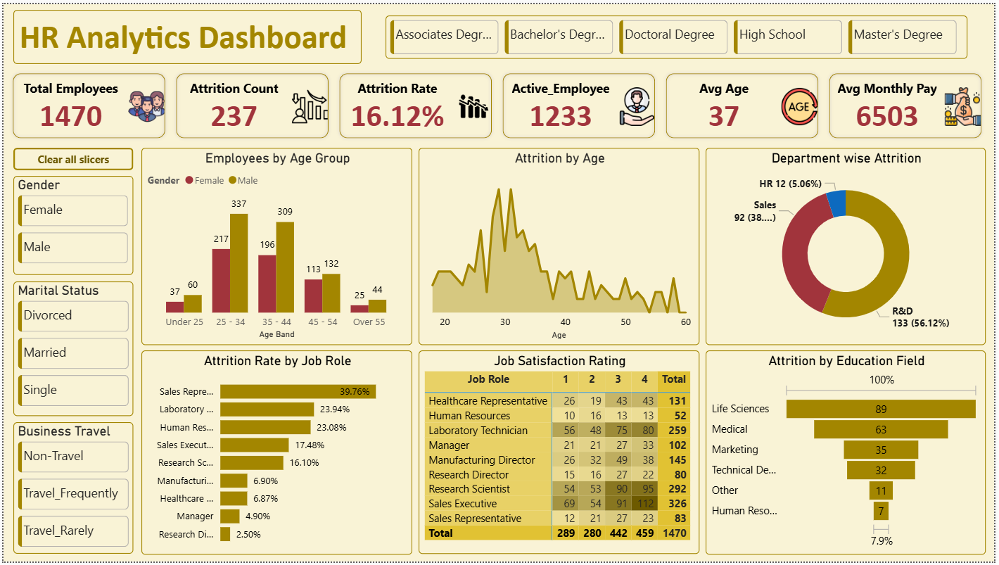

# HR Analytics Dashboard 📊
## Project Overview
This HR Analytics Dashboard project helps analyze employee attrition, workforce demographics, job satisfaction, and department-wise insights using interactive visualizations.
The dashboard provides meaningful business insights that help understand employee trends and attrition patterns.
---
## Key Insights
- Total Employees Analysis
- Attrition Count & Attrition Rate
- Department-wise Attrition
- Age Group Analysis
- Job Satisfaction Rating
- Education Field Analysis
- Employee Demographics
---
## Tools & Skills Used
- Microsoft Excel / Power BI
- Pivot Tables
- Data Cleaning
- Data Modeling
- Dashboard Design
- Data Visualization
---
## Dashboard Preview

---
## Files Included
- HR Analytics Dashboard File
- Dataset / Practice File
- Dashboard Screenshot
---
## Author
Shakthi Sharma
